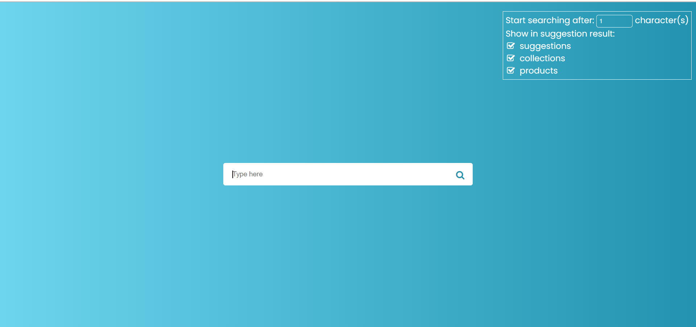

# Auto-suggestion box

## UI Interface

## Guideline

To apply this to any textbox:\
First, You need to apply style and script in your index.html file\
Second, You can change your textbox by changing code on line 28 in index.html. To use another style for that input, add new class to that input and define its style in file assets/css/autocomplete.css

You can also provide new block for suggestion result by three steps:

1. Create new block in index.html file
2. Define a new class in model.js
3. Define an instance in factory.js

## Demo

[Youtube](https://youtu.be/eWKrD3MGAD8)

## Resources

- [Suggestions data](http://www.json-generator.com/api/json/get/bZCGtZOqDC?indent=2)
- [Collections data](http://www.json-generator.com/api/json/get/bTwjXsUGGa?indent=2)
- [Products data](http://www.json-generator.com/api/json/get/bULaCnUWGa?indent=2)
